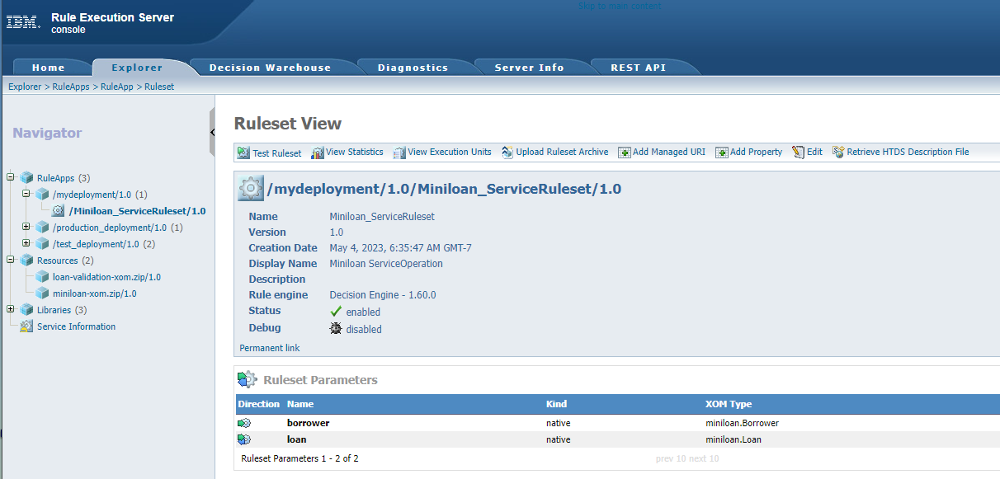
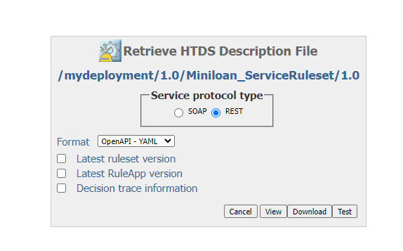

# Build solution

Developing a new solution should be simple, but potential complexity will be dependant of the level of integration needed, as usual. 

To get started consider the scope of the demonstration and assess if you need to:

- Use a specific LLM backend
- Have an existing decision service available to be used or if you need to develop a new one. A new decision service means new rules but also a new execution model.

## Develop your own demonstration

As a first tutorial we will use an existing decision service deployed to the decision server.

### Create project

This will be automatised as of now it is manual:

* Create a folder for your project: `IBM-MiniLoan-demo`
* Copy the project template to the new folder

```sh
cp -r demo_tmpl/ IBM-MiniLoan-demo
cd IBM-MiniLoan-demo
```

* Create and Start a Python virtual environment

```sh
python -m venv .venv
# For windows PC
source .venv/Scripts/activate
# For unix based PC
source .venv/bin/activate
```

  *The creation is needed only for the first time.*

* Install the Python modules needed for the solution

```sh
pip -r ibu-backend/src/requirements.txt
```

### Build the object model for decision service

The decision service exposes an REST API with an Open API document. From this document it is easy to get the data model and create Python Pydantic object. Here are the steps

1. Access the ODM Developer Edition console at [http://localhost:9060/](http://localhost:9060/), select he decision server console
1. Navigate to the RuleApp > Ruleset in the `Explorer` tab that you want to call:

    

1. Get the OpenAI yaml document and download it to a project folder `ibu_backend/src/openapi`.
    
    

1. Run the command to build the pydantic model

```sh
datamodel-codegen  --input MydeploymentMiniloan_ServiceRulesetDecisionService.yaml --input-file-type openapi --output ../ibu/itg/ds/pydantic_generated_model.py
```

*If needed review the input and optional fields as some empty attribute may generate null pointer exception in the rules* For example approved need to be inialised to False and messages to be an empty array instead of None:

```python
    yearlyRepayment: Optional[int] = None
    approved: Optional[bool] = False
    messages: Optional[List[str]] = []
```

### Build the python function to call ODM

In the code template `src/ibu/llm/tools/client_tools.py` define a new function to expose simple parameters

```python
def assess_loan_app_with_decision(loan_amount: int, duration: int,   first_name: str, last_name: str):
    loanRequest= Loan(duration=duration, 
                             amount=loan_amount)
    
    borrower =  build_or_get_loan_client_repo().get_client_by_name(first_name=first_name, last_name=last_name)
    ds_request = Request(__DecisionID__= str(uuid.uuid4),borrower=borrower, loan=loanRequest)
    payload: str = ds_request.model_dump_json()
    return callRuleExecutionServer(payload)
```
### Define Tools

The classical common integration is when the solution needs to get data from an existing database or better a microservice managing a specific business entity. In this case the solution leverage a python function that can remote call the microservice URL using library like `requests`.

For short demonstration you may need to implement some mockup repository that could be integrated into the demo run time.

#### Adding a function as tool

OpenAI has started the initiative of function calling and now most of the major proprietary or open source LLM model supports tool calling. As Owl Agent is using LangGraph for agent orchestration, we will use LangChain tools API to define function calling.

There are [three ways](https://python.langchain.com/v0.1/docs/modules/tools/custom_tools/) to do so with LangChain: function annotation, using a factory function or class sub-classing. 

The tool annotation is the simplest approach. The following declaration uses annotation, and the argument names, type and comment description are very important as they will be injected as context in the prompt to the LLM. Be sure to be short but brings semantic so the LLM can decide to call the function to get more information about a client, and being able to extract the first and last names from the query message.

```python
@tool
def get_client_by_name(first_name: str, last_name: str) -> str | None:
    """get borrower client information given his or her name"""
    return build_or_get_loan_client_repo().get_client_by_name_json(first_name,last_name)

```

### Define Assistant

Add the following base declaration for the main Assistant of the solution. One Assistant per use case.

```yaml
ibu_assistant:
  assistant_id: ibu_assistant
  class_name: athena.llm.assistants.BaseAssistant.BaseAssistant
  description: A default assistant that uses LLM, and local defined tools like get borrower, and next best action
  name: IBU Loan App assistant
  agent_id: ibu_agent
```

The two important properties are the class_name and the agent_id.

The class name is coming from Owl Agent core library. This is the LangGraph flow with tool and LLM. The graph looks like in the following figure:


### Define Agent


### Define prompt

### Integration tests

### Custom user interface


## Troubleshooting

Access to the logs of decision server or owl backend server by doing

```sh
docker logs owl-backend
docker logs decisionsvc
```

### Exception when starting ODM decision server 

The trace of the decision service may log an exception of sequence number already created. 

```sh
 org.h2.jdbc.JdbcSQLSyntaxErrorException: Sequence "SYSTEM_SEQUENCE_AAD2612D_FF17_4435_A436_6D4A63BF6D6E" already exists; SQL statement:
```

This may come from previous execution on a new database. Just deleting the `decisions/persistence` folder, and restarting the decision server solved the problem.