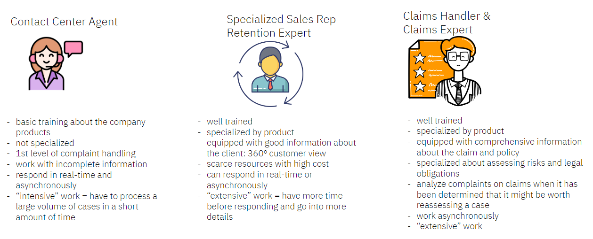
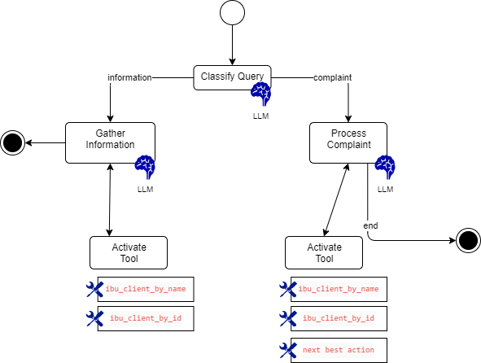

# IBU Insurance

???+ Info "Version"
    Created 05/2024. Updated 07/01/2024 - STILL UNDER WORK

The IBU insurance demonstration illustrates the integration with data manager service, a decision service, a vector store and a LLM as shown in the figure below:

{ width=800 }

## Goals

The IBU Insurance agent chatbot helps IBU Insurance’s customer service representatives manage customer complaints about their claims handling. The chatbot is used by the customer service reps when a customer calls or writes with a complaint.

The chatbot should bring consistent responses and actionable decisions, which improves the complain management by more than 27% and improve the quality responses by 35% while reducing the cost by around 60%. 


[](https://www.youtube.com/watch?v=fGEU_obHM5M){ width=600 }

[Link to video](https://www.youtube.com/watch?v=fGEU_obHM5M)


## Insurance context

In most insurance organization we may find the following roles Involved in Complaint Handling process:



The AI assistant will help the contact center agents.

In the insurance industry the strategy to better manage customers is based on a metric called the Customer LifeTime Value or CLTV. The higher the value, the better will be the customer support, with some personalized service with dedicated advisor. At the lower range, the insurance may let their customers go away as it might actually reduce adverse selection and improve the overall profitability of the company. Finally for the bigger part of the customer profile, the company may want to retain them but using some retention effort at the minimum cost. 

As part of the automated chatbot integration the business policy may first evaluate the risk of churn and then reassign the interaction to the retention department if needed.

## Build for demonstration

For development purpose build the DataManager microservice images:

```sh
cd datamgt
./build/buildImage.sh
```

The docker image for the DataManager microservice, the chatbot frontend and for the OWL Backend are available on docker hub.


The docker compose starts by downloading docker images from Docker Hub. Those images were built on intel based architecture. If you run on arm architecture like the MAC M1... family, you need to build the owl backend and owl front end images ([See the instructions here.](https://athenadecisionsystems.github.io/athena-owl-core/design/#pre-requisites)). 

## Run locally

To start all the components of the solution like the owl_backend, the owl_frontend, the data manager, postgresql database, and the ODM decision service, use the docker compose file locally under the `IBU-insurance-demo/deployment/local/` folder. 

```sh
docker-compose up -d 
```

The first time you launch it, it may take some time as it downloads the needed docker images.

Verify that the six containers are running:

```sh
docker ps
```

```
2ecb23b78ad5   jbcodeforce/ibu-insurance-data-mgr:latest  0.0.0.0:8080->8080/tcp, 8443/tcp         datamgr
3988ffd617c6   jbcodeforce/athena-owl-backend:latest      0.0.0.0:8000->8000/tcp                   owl-backend
258460ed25ed   jbcodeforce/athena-owl-frontend:latest      0.0.0.0:3000->80/tcp                   owl-frontend
349f3beb4174   icr.io/cpopen/odm-k8s/odm:8.12             0.0.0.0:9060->9060/tcp, 9080/tcp, 0.0.0.0:9443->9443/tcp, 9453/tcp   decisionsvc
070e124923f7   postgres:latest                            0.0.0.0:5432->5432/tcp                   postgres
86052092cfe7   ghcr.io/chroma-core/chroma:latest          0.0.0.0:8005->8000/tcp                   chroma-db
```

To look at owl-backend logs

```sh
docker logs owl-backend
```

Next see the demonstration script section, or the non-regression tests to automate scenario execution.


## Demonstration Flows

The business policies are declared in a semi structured document, and were extracted using the "Agile Business Rule development Methodology". An extract of this document is show in the figure below:


* The business policy 52 can be implemented in IBM ODM as the following rule:


Which is visible in the Decision Center at the address [http://localhost:9060/decisioncenter](http://localhost:9060/decisioncenter/login).

* Now to illustrate that using the policy document as input for a Retrieval Augmented Generation will not provide that much value, we can use the OWL Frontend user's interface at [http://localhost:3000/](http://localhost:3000/):


Once the document is uploaded, you can use the OWL_backend API to do a some similarity search on the document content. The URL for the API is [http://localhost:8000/docs](http://localhost:8000/docs) The API is in the documents RESTful resource.

* Using the following query: "" we can see that the LLM with or without RAG does not give the real answer, and also at different time, it returns different answer


* Setting the flag to use ODM, give the result according to the rules:


## Architecture

The high level the architecture for this demonstration looks like in the figure below:

{ width=800 }

* A chatbot supports the interactions with a customer support representative using natural language queries
* The assistant server manages the conversation and the integration with different backends. There are two assistants defined for this demonstration, one using IBM ODM decision service, one without it. 

## Component Definitions

### Define Assistant



### Define Agent

### Define Tools

### Define prompt

### Non-regression tests

Under the `e2e` folder you can find different tool to support automatic testing

```sh
python non_regression_tests.py
```
