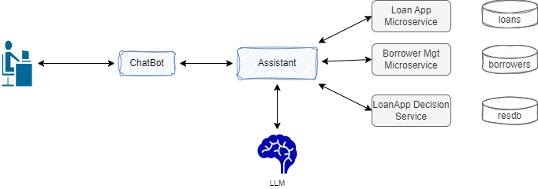

# IBM Miniloan ODM demonstration with Agent


## Goals

The Miniloan application is part of the IBM Operational Decision Management product and [tutorial](https://www.ibm.com/docs/en/odm/8.12.0?topic=rules-tutorials). The goal of this demonstration is to illustrate how unstructured query in natural language can be decomposed and call to decision service to get a loan application pre-approved can be done with Owl Framework.

The questions that are tested and validated are:

* What is the credit score of Robert Smith?
* My client robert smith wants to borrow $1,000,000 for 180 months do you think it is possible?
* My client jean martin wants to get a $300,000 loan for 120 months for his house enhancement, do you think it is possible?

## Architecture

The high level the architecture for this demonstration looks like in the figure below:



* A chatbot supports the interactions with a customer support representative with natural language queries
* The assistant server manages the conversation and the integration with different backends
* The Loan App Decision service is the SAMPLE RuleApp deployed in a Rule Execution Server
* The different microservices to access the client database as future or existing borrowers, and the loan applications repository.
* The LLM is an externally Large Language Model accessible via API. Different models can be used.

To make it easier the loanApp and client the repositories are mockup and loaded in memory.

## Demonstration Flows

* Start the docker compose with all the components of the above architecture.

```sh
cd IBM-MiniLoan-demo/deployment/local/
docker compose up -d
```

The backend APIs is available at the following URL [http://localhost:8000/docs](http://localhost:8000/docs).

* Run a demonstration script to validate the deployment and the integration with LLM:

```sh
# under the e2e folder
python non_regression_tests.py
```

## Agentic with Rule Engine

This section explains the OWL framework usage to support the demonstration. 

An assistant supports a customer representative to answer questions and queries about a loan. Assistant uses an agent, which is linked to the LLM to use and the tool definitions.


* The assistant is simple and uses the BaseAssistant from Owl framework which uses LangChain chain with or without tools

```yaml
ibu_assistant:
  assistant_id: ibu_assistant
  class_name: athena.llm.assistants.BaseAssistant.BaseAssistant
  description: A default assistant that uses LLM, and local defined tools like get borrower, and next best action
  name: IBU Loan App assistant
  agent_id: ibu_agent
```

* The agent lists the prompt, and tools to use, with the supporting code and LLM model

```yaml
ibu_agent:
  agent_id: ibu_agent
  name: ibu_agent
  description: openai based agent with IBU loan app prompt and tools
  class_name: athena.llm.agents.base_chain_agent.OwlAgent
  modelName: gpt-3.5-turbo-0125
  modelClassName: langchain_openai.ChatOpenAI
  prompt_ref: ibu_loan_prompt
  tools:
  - ibu_client_by_name
  - ibu_loan_assessment_action
```

* Tool definition looks like for getting data about the borrower

```yaml
ibu_client_by_name:
  tool_id: ibu_client_by_name
  tool_class_name: 'ibu.llm.tools.client_tools'
  tool_description: 'get client information given his or her name'
  tool_fct_name: get_client_by_name
```

* And delegating calls to ODM Decision service

```yaml
ibu_loan_assessment_action:
  tool_id: ibu_loan_assessment_action
  tool_class_name: ibu.llm.tools.client_tools
  tool_description: 'perform the loan application request assessment for the given borrower name'
  tool_fct_name: assess_loan_app_with_decision
```

## Development around the demonstration

In case you need to work on the current demonstration, and run some of the test cases, this section addresses what needs to be done to run on you local laptop with Docker engine. Currently in development mode the source code of the core framework is needed so you need to clone it.

```sh
# for example in $HOME/Code/Athena

git clone https://github.com/AthenaDecisionSystems/athena-owl-core
```

### Unit tests

* Define the PYTHONPATH so the core modules can be accessed during the tests execution

```sh
    export PYTHONPATH=$WHERE_YOUR_CODE_IS/athena-owl-core/owl-agent-backend/src
```

* Run all unit tests

```sh
pytest -s tests/ut
```

### Integration tests

For integration tests we need to start the backend using Docker Compose, then run all the integration tests via


```sh
pytest -s tests/it
```

### Code Explanations

The previous section demonstrates the Yaml manifests for the declaration of the assistant, agent and tools. Each demonstration will have different tools. This section explains the tools implemented in the demonstration.

The tool function coding is done in one class, the [client_tools.py](https://github.com/AthenaDecisionSystems/athena-owl-demos/blob/main/IBM-MiniLoan-demo/ibu_backend/src/ibu/llm/tools/client_tools.py).

Taking the tool definition below

```yaml
ibu_loan_assessment_action:
  tool_id: ibu_loan_assessment_action
  tool_class_name: ibu.llm.tools.client_tools
  tool_description: 'perform the loan application request assessment for the given borrower name'
  tool_fct_name: assess_loan_app_with_decision
```

The module `ibu.llm.tools.client_tools` includes the function `assess_loan_app_with_decision` 

